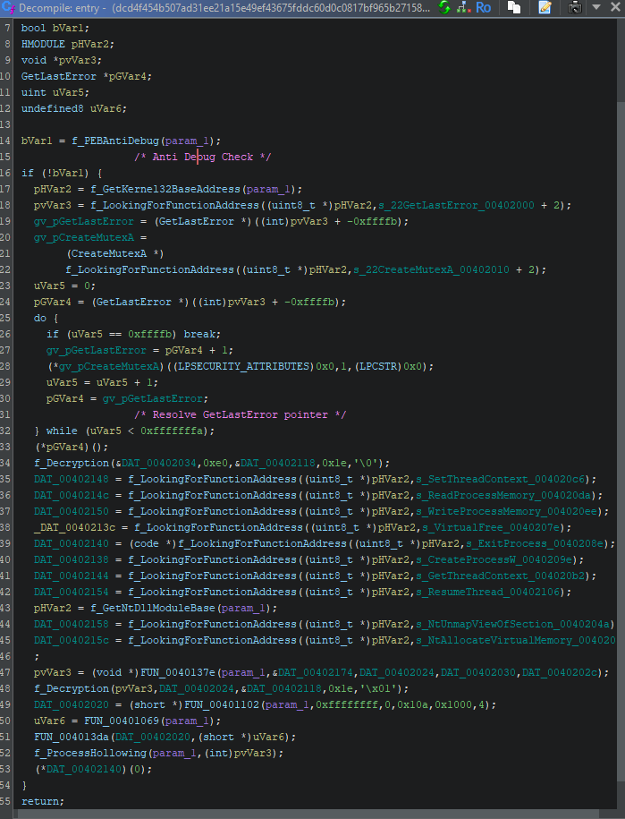
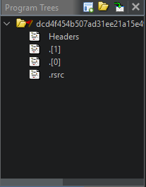

## Description
There is some a crypter with a shitty stub and with the sections ".[1]" and ".[0]" that performs one anti debug check and Process Hollowing to execute the encrypted binary inside of it.
I wrote something in order to extract the encrypted binary.

- Entry point 
- Sections
